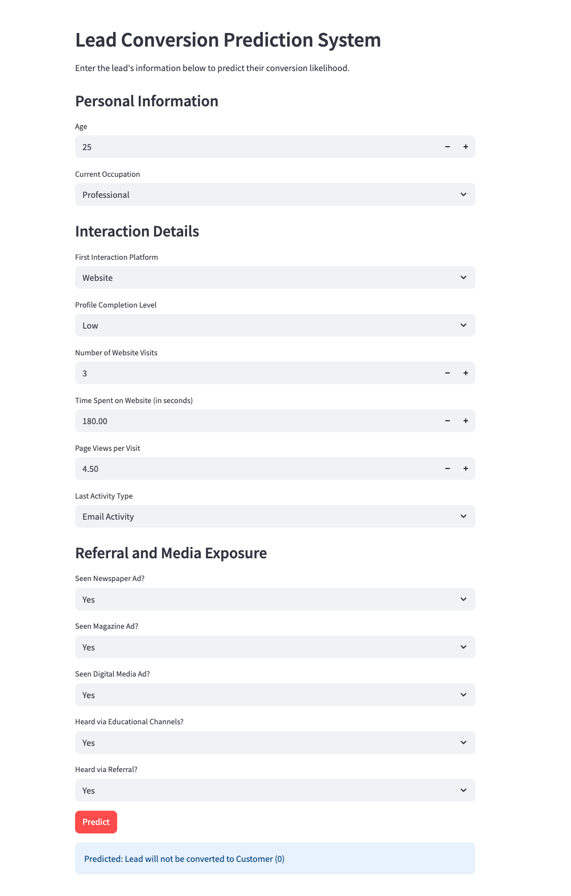

# Model to predict if leads will convert or not

ExtraaLearn Lead Conversion Prediction
This project focuses on building a machine learning model to predict lead conversion for ExtraaLearn, an EdTech startup.

# ExtraaLearn Lead Conversion Prediction

This project focuses on building a machine learning model to predict lead conversion for ExtraaLearn, an EdTech startup.

---

## Overview

This project aims to solve the problem of efficiently identifying potential converting leads for ExtraaLearn. By leveraging machine learning, the project helps optimize resource allocation, improve marketing strategies, and enhance overall business efficiency. The solution benefits ExtraaLearn by providing data-driven insights to prioritize sales efforts and increase conversion rates.

---
<center> </center>

## Business Problem

ExtraaLearn, an EdTech startup, faces the challenge of efficiently converting a large volume of generated leads into paid customers. The primary objective of this project is to develop a machine learning model that can accurately predict which leads are most likely to convert. This model will help answer key questions such as:

*   Which leads should the sales team prioritize for follow-up?
*   What are the most significant factors influencing a lead's conversion decision?
*   How can ExtraaLearn create a profile of high-converting leads to target future marketing efforts more effectively?

---

## Dataset

### Source
The dataset was provided by ExtraaLearn, loaded from `/content/drive/MyDrive/MLProjects/ExtraLearn/ExtraLearn.csv`.

### Description
*   **Number of records**: 4612
*   **Number of features**: 14 (initially 15, 'ID' column dropped)
*   **Target variable**: `status` (binary: 0 for not converted, 1 for converted)

### Key Variables
| Feature | Description |
|---|---|
| ID | ID of the lead (dropped during preprocessing) |
| age | Age of the lead |
| current_occupation | Current occupation of the lead. Values include 'Professional', 'Unemployed', and 'Student'. |
| first_interaction | How the lead first interacted with ExtraaLearn. Values include 'Website', 'Mobile App'. |
| profile_completed | Percentage of profile filled by the lead. Values include 'Low' (0-50%), 'Medium' (50-75%), 'High' (75-100%). |
| website_visits | Number of times a lead visited the website. |
| time_spent_on_website | Total time spent on the website in seconds. |
| page_views_per_visit | Average number of pages on the website viewed during the visits. |
| last_activity | Last interaction between the lead and ExtraaLearn. |
| print_media_type1 | Flag indicating whether the lead had seen the ad of ExtraaLearn in the Newspaper. |
| print_media_type2 | Flag indicating whether the lead had seen the ad of ExtraaLearn in the Magazine. |
| digital_media | Flag indicating whether the lead had seen the ad of ExtraaLearn on the digital platforms. |
| educational_channels | Flag indicating whether the lead had heard about ExtraaLearn in education channels. |
| referral | Flag indicating whether the lead had heard about ExtraaLearn through reference. |
| status | Target: Flag indicating whether the lead was converted to a paid customer or not (0/1). |

---

## Project Workflow

### 1. Data Collection
The dataset was provided as a CSV file (`ExtraLearn.csv`) and loaded directly from Google Drive into a pandas DataFrame.

### 2. Data Cleaning
*   **Duplicate Removal**: Checked for and confirmed no duplicate rows were present.
*   **Unique Identifier Removal**: The 'ID' column, being a unique identifier, was dropped as it holds no predictive power.

### 3. Exploratory Data Analysis (EDA)
*   **Univariate Analysis**: Histograms and boxplots were used to analyze the distribution of numerical features. Labeled bar plots were generated for categorical features to understand their distributions.
*   **Bivariate Analysis**: Correlation heatmap for numerical features. Stacked bar plots were used to examine the relationship between categorical features and the target variable (`status`). Distribution plots with respect to the target were used for numerical features to understand how their distributions differ between converted and non-converted leads.
*   **Major Findings**: Identified key factors such as `current_occupation` (Professionals higher conversion), `first_interaction` (Website higher conversion), `time_spent_on_website` (converted leads spend more time), `profile_completed` (High completion leads to higher conversion), `last_activity` (Email and Website activity more effective), and `referral` (highly effective).

### 4. Feature Engineering
*   **Encoding Categorical Features**: Categorical features were one-hot encoded using `OneHotEncoder` as part of a `ColumnTransformer` within a scikit-learn `Pipeline`. No explicit new features were created, and numerical features were not scaled as tree-based models are generally robust to varying scales.

### 5. Model Development
*   **Algorithms Tested**: Random Forest Classifier and AdaBoost Classifier were selected.
*   **Hyperparameter Tuning**: `GridSearchCV` was employed to find the optimal hyperparameters for both models. For Random Forest, `max_depth`, `max_features`, and `n_estimators` were tuned. For AdaBoost, `n_estimators` and `learning_rate` were tuned.
*   **Validation Approach**: 3-fold cross-validation was used with `GridSearchCV`.
*   **Evaluation Metric**: `recall_score` was used as the primary scoring metric for `GridSearchCV` to prioritize minimizing false negatives.

### 6. Model Evaluation
*   **Evaluation Metrics Used**: Accuracy, Recall, Precision, and F1-score were used to evaluate model performance on both training and test sets.
*   **Comparison of Models**: The Random Forest Tuned model demonstrated the best performance, achieving a Recall score of 0.5545 on the test set, significantly outperforming other models, including an AdaBoost Tuned model that failed to predict any positive class instances (Recall 0.0).

---

## Technologies Used

*   **Python**
*   **Pandas**: For data manipulation and analysis.
*   **NumPy**: For numerical operations.
*   **Scikit-learn**: For machine learning model development, preprocessing, model selection, and evaluation metrics.
*   **Matplotlib**: For basic plotting and visualization.
*   **Seaborn**: For enhanced statistical data visualization.
*   **joblib**: For model serialization and deserialization.
*   **huggingface_hub**: For programmatic interaction with Hugging Face Hub (repository creation, file uploads).
*   **requests**: For making HTTP requests to the deployed Flask API.
*   **Flask**: For building the backend API to serve model predictions.
*   **Gunicorn**: For deploying the Flask application.
*   **Streamlit**: For creating the interactive frontend user interface.
*   **Jupyter Notebook / Google Colab**: As the development environment.

---

## Results

### Model Performance (Random Forest Tuned on Test Set)

| Metric | Score |
|----------|---------|
| Accuracy | 0.796243 |
| Precision | 0.713415 |
| Recall | 0.554502 |
| F1 Score | 0.624000 |

### Key Findings

*   **Professionals** and leads with **website-initiated first interactions** exhibit higher conversion rates.
*   **Time spent on the website** and **profile completion level** are strong indicators of conversion likelihood.
*   **Email Activity** and **Website Activity** as last interactions are more effective in nurturing leads compared to phone activity.
*   **Referrals**, though less frequent, have a very high conversion rate.
*   The Random Forest Tuned model is effective in identifying potential converting leads, achieving a recall of 55.45% on the test set.

---

## Visualizations

Key visualizations from the project include:

*   **Correlation Heatmap**: To understand relationships between numerical features.
*   **Feature Distribution Plots**: Histograms and boxplots for numerical features like `age`, `website_visits`, `time_spent_on_website`, `page_views_per_visit`.
*   **Categorical Feature Distribution Plots**: Labeled bar plots for features like `current_occupation`, `first_interaction`, `profile_completed`, `last_activity`, etc.
*   **Stacked Bar Plots**: Illustrating conversion rates across different categories, e.g., `current_occupation` vs. `status`, `first_interaction` vs. `status`.
*   **Distribution Plots with Target**: Comparing the distributions of numerical features for converted vs. non-converted leads.

*(To include actual images in your GitHub README, you would typically save these plots to an `images/` directory within your repository and link them using markdown, e.g., ``)*

---

## Repository Structure

```
ExtraaLearn-Lead-Conversion/
│
├── backend_files/                  # Contains Flask app, model, Dockerfile, requirements for backend deployment
│   ├── app.py                      # Flask API application
│   ├── Dockerfile                  # Dockerfile for backend
│   ├── learn_model.joblib          # Serialized ML model
│   └── requirements.txt            # Python dependencies for backend
│
├── frontend_files/                 # Contains Streamlit app, Dockerfile, requirements for frontend deployment
│   ├── app.py                      # Streamlit UI application
│   ├── Dockerfile                  # Dockerfile for frontend
│   └── requirements.txt            # Python dependencies for frontend
│
├── ExtraaLearn_Lead_Prediction.ipynb # Jupyter Notebook with the full project code and analysis
├── ExtraaLearn.csv                 # Raw dataset (assumed to be in the root for local execution)
└── README.md                       # Project README file
```

---

## Installation

To set up the project locally, follow these steps:

```bash
# Clone the repository
git clone <repository-url>
cd ExtraaLearn-Lead-Conversion

# Create and activate a virtual environment (optional but recommended)
python -m venv venv
source venv/bin/activate # On Windows use `venv\Scripts\activate`

# Install backend dependencies
pip install -r backend_files/requirements.txt

# Install frontend dependencies
pip install -r frontend_files/requirements.txt

# For notebook dependencies (if running the notebook in a local environment, not Colab)
# pip install numpy==2.0.2 pandas==2.2.2 scikit-learn==1.6.1 matplotlib==3.10.0 seaborn==0.13.2 joblib==1.4.2 xgboost==2.1.4 requests==2.32.3 huggingface_hub==0.30.1
```

*(Replace `<repository-url>` with the actual URL of your GitHub repository once created)*
